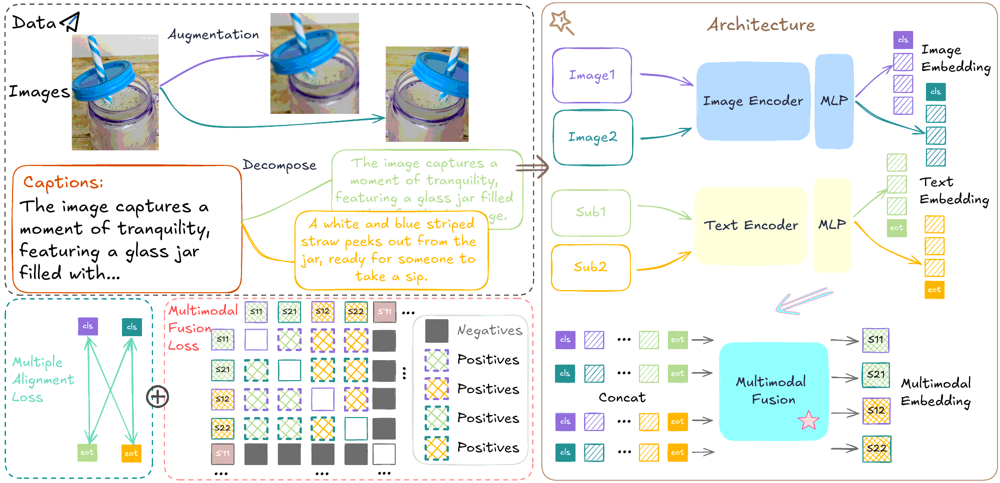

# [NeurIPS 2026] ITO: Multi-View Alignment and Training-Time Fusion for Image-Text Pretraining

Hanpeng Liu, Zidan Wang, Shuoxi Zhang, Zonglin Zhao, Zihao Bo, Rinyoichi Takezoe, Kaiwen Long, Yaqian Li, Kun He

Official PyTorch implementation of **ITO**, built on [OpenCLIP](https://github.com/mlfoundations/open_clip).

<p align="center">
  
</p>

## Overview

Image-text contrastive pretraining (CLIP) aligns each image with its caption, but the learned representations often stay
partly organized by modality rather than by semantics. ITO addresses this with two training-time components:

- **Multimodal multiple alignment.** Each image is augmented into two views, and every view is contrasted against the
  caption with the standard CLIP loss. This multiplies the cross-modal positives in a batch and provides the main
  accuracy gain.
- **Training-time multimodal fusion.** The image tokens and text tokens of each view are concatenated and passed
  through a lightweight 2-layer Transformer. The fused representations of the two views of the same pair are
  treated as positives, and all other fused representations in the batch as negatives. The loss flows back into both
  encoders and acts as a regularizer that makes their features compatible under fusion.

The fusion module is **discarded at inference**. A trained ITO model is a standard CLIP dual encoder, with the same
inference cost and the same interface for zero-shot classification, retrieval, or use as an MLLM vision backbone.

The training objective is

$$\mathcal{L} = \mathcal{L}_{\mathrm{Align}} + \lambda \cdot \mathcal{L}_{\mathrm{Fusion}}, \qquad \lambda = 2 \text{ by default.}$$

## Results

All models use ViT-B/16 and 30 epochs unless noted. See the paper for full per-dataset tables, linear probing,
retrieval and LLaVA-1.5 results.

**Zero-shot classification** (average top-1 over 26 benchmarks, EVA-CLIP protocol):

| Pretraining data | CLIP | SLIP | SigLIP | FLAIR | **ITO** |
| --- | :-: | :-: | :-: | :-: | :-: |
| CC3M | 19.3 | 21.4 | 19.3 | 23.2 | **24.9** |
| CC12M | 34.1 | 36.0 | 35.0 | 35.5 | **38.4** |
| YFCC15M | 30.5 | – | – | – | **34.5** |
| Laion100M | 53.5 | 51.3 | – | – | **56.1** |
| DataComp-1B (1 epoch) | 54.2 | – | – | – | **56.6** |
| DataComp-1B, 10 epochs | 63.7 | – | – | – | **64.9** |
| DataComp-1B, ViT-L/16, 1 epoch | 60.7 | – | – | – | **63.0** |

**Contribution of each component** (ImageNet-1K zero-shot / linear probe, MSCOCO retrieval R@1):

| Data | Setting | ZS IN-1k | Linear IN-1k | COCO I→T | COCO T→I |
| --- | --- | :-: | :-: | :-: | :-: |
| YFCC15M | OpenCLIP | 36.4 | 51.8 | 26.4 | 15.1 |
| | + multiple alignment (λ=0) | 43.7 | 60.2 | 30.6 | 19.6 |
| | + training-time fusion (λ=2) | **44.3** | **60.5** | **30.8** | 19.5 |
| DataComp-1B | OpenCLIP | 63.1 | 67.4 | 47.1 | 29.5 |
| | + multiple alignment (λ=0) | 64.8 | 69.6 | 49.0 | 30.7 |
| | + training-time fusion (λ=2) | **65.9** | **69.9** | **49.3** | **31.3** |

**Cost.** Inference cost is identical to CLIP. Training takes about 2.2× the time and 2.1–2.3× the peak GPU memory of
OpenCLIP, because each sample is encoded with two image views and passes through the fusion module twice.

## Installation

```bash
git clone https://github.com/showstarpro/ITO.git
cd ITO
pip install -r requirements-training.txt
pip install -e .
```

The package is installed as `open_clip_torch` and imported as `open_clip`, like upstream OpenCLIP.

## Data

Training uses the [webdataset](https://github.com/webdataset/webdataset) format: a set of `.tar` shards where each
sample has an image (`.jpg`/`.png`/`.jpeg`/`.webp`) and a caption (`.txt`) with the same key. Tools such as
[img2dataset](https://github.com/rom1504/img2dataset) can download CC3M, CC12M, YFCC15M, LAION, and DataComp in this
format. ImageNet-1K validation images (one folder per class) are used for zero-shot evaluation during training.

## Training

Training scripts for ViT-B/16 are in [scripts/ito/](scripts/ito/):

```bash
# CC12M (8 GPUs x 256 = global batch 2048)
CC12M_DIR=/path/to/cc12m IMAGENET_VAL=/path/to/imagenet/val bash scripts/ito/train_cc12m.sh

# YFCC15M (global batch 4096, e.g. 2 nodes x 8 GPUs x 256)
YFCC15M_DIR=/path/to/yfcc15m IMAGENET_VAL=/path/to/imagenet/val bash scripts/ito/train_yfcc15m.sh
```

Set `NPROC_PER_NODE` to change the number of GPUs, and `NNODES` / `NODE_RANK` / `MASTER_ADDR` / `MASTER_PORT` for
multi-node runs of the YFCC15M script. If you change the GPU count, adjust `--batch-size` to keep the global batch size.
Extra arguments are forwarded to `open_clip_train.main`, e.g. `--report-to wandb` or `--resume /path/to/ckpt.pt`.

ITO adds the following arguments to the OpenCLIP trainer:

| Argument | Default | Description |
| --- | --- | --- |
| `--aug` | off | Enables ITO: loads two augmented views per image and trains with the alignment and fusion losses. Requires `--dataset-type webdataset`. |
| `--aug-cfg` | – | Augmentation policy for the two views. The paper uses `scale=0.5,1.0 color_jitter=0.4,0.4,0.4,0.1 color_jitter_prob=0.8 gray_scale_prob=0.2`. |
| `--alpha` | `2` | Fusion loss weight λ. `--alpha 0` gives the alignment-only variant. |
| `--sentence-pool` | `cls` | Read-out of the fusion module: `cls` (image `[CLS]` token, used in the paper), `mean` (mean over valid tokens), or `token` (an extra learnable token). |

## Evaluation

Zero-shot ImageNet-1K evaluation of a trained checkpoint:

```bash
bash scripts/ito/eval_zeroshot.sh /path/to/checkpoints/epoch_30.pt /path/to/imagenet/val
```

If the checkpoint was trained with `--sentence-pool mean` or `token`, set `SENTENCE_POOL` to the same value so the
checkpoint loads without missing or unexpected keys.

For the 26-dataset zero-shot benchmark and retrieval, the image and text encoders can be evaluated with
[CLIP_benchmark](https://github.com/LAION-AI/CLIP_benchmark) like any OpenCLIP model.

## Using a trained model

Only the image and text encoders are used at inference. Note that in this codebase `encode_image` and `encode_text`
also return the token features needed by the fusion module, so take the first element of each result:

```python
import torch
from PIL import Image
import open_clip

model, _, preprocess = open_clip.create_model_and_transforms('ViT-B-16', pretrained='/path/to/epoch_30.pt')
tokenizer = open_clip.get_tokenizer('ViT-B-16')
model.eval()

image = preprocess(Image.open('example.jpg')).unsqueeze(0)
text = tokenizer(['a photo of a dog', 'a photo of a cat'])

with torch.no_grad():
    image_features, _ = model.encode_image(image, normalize=True)
    text_features, _, _ = model.encode_text(text, normalize=True)
    probs = (100.0 * image_features @ text_features.T).softmax(dim=-1)
```

## Code structure

The ITO-specific changes to OpenCLIP are:

| File | Change |
| --- | --- |
| [src/open_clip/model.py](src/open_clip/model.py) | Fusion module (`sentence_transformer`, 2 layers) and `forward_sentence`; `forward` encodes both image views and returns their fused features. |
| [src/open_clip/loss.py](src/open_clip/loss.py) | `ClipLoss` computes the multiple alignment loss over both views and the multi-positive fusion loss weighted by `alpha`. |
| [src/open_clip_train/data.py](src/open_clip_train/data.py) | With `--aug`, the webdataset pipeline returns two augmented views of each image. |
| [src/open_clip_train/train.py](src/open_clip_train/train.py) | Stacks the two views into one batch tensor. |
| [src/open_clip_train/params.py](src/open_clip_train/params.py) | New arguments `--aug`, `--alpha`, `--sentence-pool`. |
| [scripts/ito/](scripts/ito/) | Training and evaluation scripts. |

In the code, the fusion module and its outputs are named `sentence_*` (e.g. `sentence_transformer`, `sentence_loss`).

## Citation

```bibtex
@inproceedings{liu2026ito,
  title     = {ITO: Multi-View Alignment and Training-Time Fusion for Image-Text Pretraining},
  author    = {Liu, Hanpeng and Wang, Zidan and Zhang, Shuoxi and Zhao, Zonglin and Bo, Zihao and Takezoe, Rinyoichi and Long, Kaiwen and Li, Yaqian and He, Kun},
  booktitle = {Advances in Neural Information Processing Systems (NeurIPS)},
  year      = {2026}
}
```

## Acknowledgement

This repository is built on [OpenCLIP](https://github.com/mlfoundations/open_clip). We thank its authors for their
excellent work. For general OpenCLIP usage, pretrained models, and training options, see the
[OpenCLIP README](https://github.com/mlfoundations/open_clip#readme). If you use this code, please also consider citing
OpenCLIP:

```bibtex
@software{ilharco_gabriel_2021_5143773,
  author    = {Ilharco, Gabriel and Wortsman, Mitchell and Wightman, Ross and Gordon, Cade and Carlini, Nicholas and Taori, Rohan and Dave, Achal and Shankar, Vaishaal and Namkoong, Hongseok and Miller, John and Hajishirzi, Hannaneh and Farhadi, Ali and Schmidt, Ludwig},
  title     = {OpenCLIP},
  month     = jul,
  year      = 2021,
  publisher = {Zenodo},
  version   = {0.1},
  doi       = {10.5281/zenodo.5143773},
  url       = {https://doi.org/10.5281/zenodo.5143773}
}
```

## License

This project is released under the MIT License, see [LICENSE](LICENSE).
